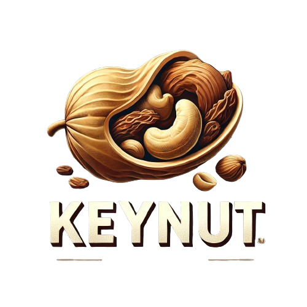

<a id="readme-top"></a>


<!-- PROJECT LOGO -->
<br />
<div align="center">
  <a href="https://github.com/faslkp/keynut">
    
  </a>

  <h3 align="center">One Bite, That's enough!</h3>
  

  <p align="center">
    Redefine the way you buy dates, nutes and dry fruits.
    <br />
    <br />
    <a href="https://keynut.kynfo.com"><strong>View Demo</strong></a>
    &middot;
    <a href="https://github.com/faslkp/keynut/issues/new">Report Bug</a>
    &middot;
    <a href="https://github.com/faslkp/keynut/issues/new">Request Feature</a>
  </p>
</div>


<br>
<br>


<!-- ABOUT THE PROJECT -->

# 🥜 Keynut – E-commerce Platform for Nuts, Dates & Dry Fruits

**Tagline**: *One Bite, That’s Enough!*

Keynut is a Python-Django-based e-commerce platform built to provide a seamless and secure shopping experience for customers looking to purchase high-quality nuts, dates, and dry fruits online. The project emphasizes backend architecture, database-driven logic, and essential e-commerce functionalities.

---

## 🚀 Project Highlights

- **Built with Django** (No any frontend frameworks)
- **Database-based cart** for persistent shopping experience
- **Custom authentication** with social login via Allauth
- **Offer & Coupon system** with multiple complex scenarios
- **Return request management** system with admin approval
- **Image handling** with frontend cropping (Cropper.js) and backend processing (ImageKit)
- **Fully functional admin panel** with product, order, and user management

---

## 🧠 Key Features

### 🔐 Authentication
- Basic login/signup with validation
- Social authentication using Django Allauth
- Session-based access control and sign-out protection

### 🛒 Cart & Orders
- Persistent, database-driven cart
- Quantity updates, remove items, empty cart options
- Order summary and checkout with validation

### 💸 Offers & Coupons
- **Product-based and category-based offers**
- **Flat and percentage-based discounts** with cap
- **Global and user-specific coupons**
- **Single-use or multi-use coupons**
- **Discounts applied on original price**
- **Only highest discount applied if multiple offers**

### 🔁 Return Requests
- Users can request returns for specific orders
- Admin panel to **accept or reject** return requests

### 🖼️ Image Management
- Integrated **Cropper.js** for frontend image cropping
- Optimized backend image handling with **Django ImageKit**

### 📦 Product Management
- Admin can add/edit/delete products with images
- Category and product variant management
- Offer settings and stock updation

---

## 🛠️ Tech Stack

- **Backend**: Python, Django
- **Database**: PostgreSQL
- **Frontend**: HTML, CSS, JavaScript, Bootstrap
- **Image Processing**: Cropper.js, Django ImageKit
- **Authentication**: Django Allauth
- **Hosting**: Google Cloud Platform

---

## ⚙️ Setup Instructions

1. **Clone the repo**
   ```bash
   git clone https://github.com/faslkp/keynut.git
   cd keynut
   ```

2. **Create virtual environment**
   ```bash
   python -m venv venv
   source venv/bin/activate  # For Windows: venv\Scripts\activate
   ```

3. **Install dependencies**
   ```bash
   pip install -r requirements.txt
   ```

4. **Configure `.env` and database**

5. **Run migrations**
   ```bash
   python manage.py makemigrations
   python manage.py migrate
   ```

6. **Create superuser**
   ```bash
   python manage.py createsuperuser
   ```

7. **Run server**
   ```bash
   python manage.py runserver
   ```

---

## 📌 Future Enhancements

- Admin Dashboard with sales data
- Cash on Delivery, Wallet, Online Checkouts
- Payment gateway integration
- Contact Form
- Referral Program
- Invoice download (PDF)
- Product reviews and ratings

---

## 🙌 Acknowledgements

- Cropper.js for frontend image cropping
- Django ImageKit for image optimization
- Django Allauth for social authentication

---

## 👨‍💻 Author

**Fasalu**  
💼 Full-stack Developer (Python Django & React)  
📫 faslkp@gmail.com  
🌐 [Portfolio Website](https://faslkp.github.io/portfolio/) | [LinkedIn](https://www.linkedin.com/in/faslkp/) | [GitHub](https://github.com/faslkp)

---

<p align="right">(<a href="#readme-top">back to top</a>)</p>


